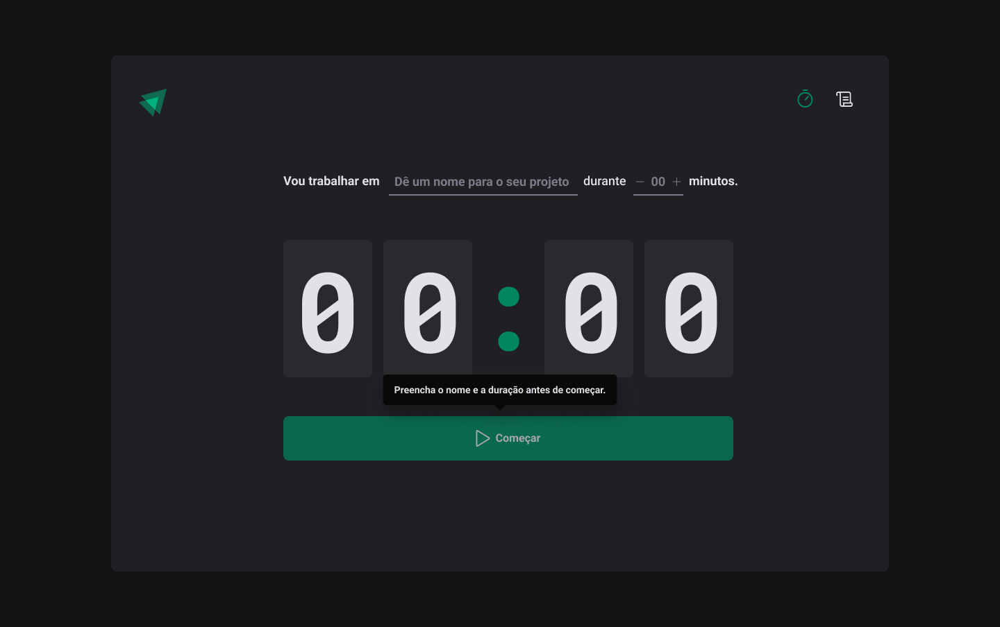

  
  
  
  
  
  
	
  
  
  

  

# Ignite Time

## ✒️ Descrição
Aplicação desenvolvida na aula de React da Trilha Ignite da Rocketseat, utilizando conceitos e ferramentas importantes do ecossistema React como Styled Components, MirageJS, Context API, hooks, Axios. O objetivo dessa aplicação e ser uma alternativa simples e eficaz para gerenciar finanças, permitindo o cadastro de entradas e saídas de valores organizando melhor as contas.

## 🚀 Tecnologias utilizadas
_(Em breve)_

## 📷 Demostração
Apresentação da tela do aplicativo.

  

## 🔥 Instalação
Clone o repositório.
~~~
git clone git@github.com:vian4dev/ignite-time.git
~~~
Acesse o diretório do projeto.
~~~
cd ignite-time/
~~~
Instale as dependências.
~~~
npm install 
~~~
Execute a aplicação.
~~~
npm run dev
~~~

## 📝 Licença
Esse projeto está sob a licença MIT. Veja o arquivo [LICENSE](LICENSE) para mais detalhes.

---

 
 
Desenvolvido por - <a href="https://github.com/vian4dev">Gabriel Viana</a> 🤖

 
  

